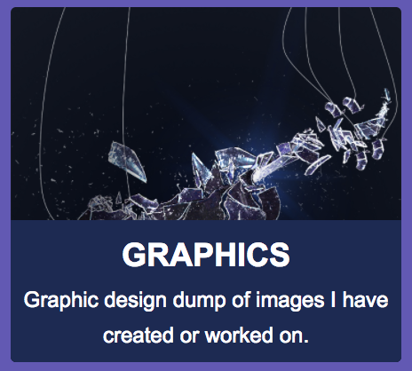
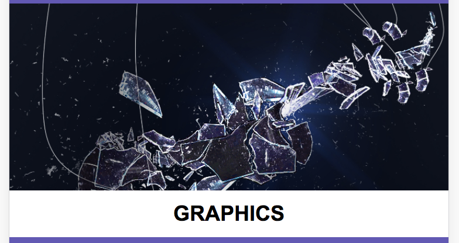
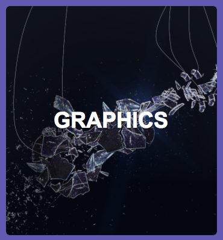

# React-Description-Container
- Image/description container that hides content until on hover, for desktop. Mobile has two different style 'modes' that can be chosen through the properties passed in.

# General
## Install -> Deactivated
- npm install --save React-Description-Container

## Properties
| Name | Type | Default | Description |
| --- | --- | --- | --- |
| `header` | string | empty string | title header for the container |
| `text` | string | empty string | description for the item |
| `url` | string | empty string | link url |
| `image` | string | empty string | image location url |
| `target` | string | empty string | if or if not links open in a new tab, ex: _blank |
| `hoverState` | boolean | false | if hover is allowed on the container |
| `color` | string | black | text color |
| `backgroundColor` | string | white | the main color of the background. seen for hover and transparent images |
| `mode` | string | two | format style type for mobile; takes 'one' or 'two'. 'One' is full width of mobile device, while 'two' is a set width/height container. |

## Example Images (09/09/18)
| O.P | Type | |
| --- | --- | --- |
| `PC/MAC` | hover false |  |
| `PC/MAC` | hover true |  |
| `Mobile` | mode one |  |
| `Mobile` | mode two |  |

### Updated: 09/09/18
